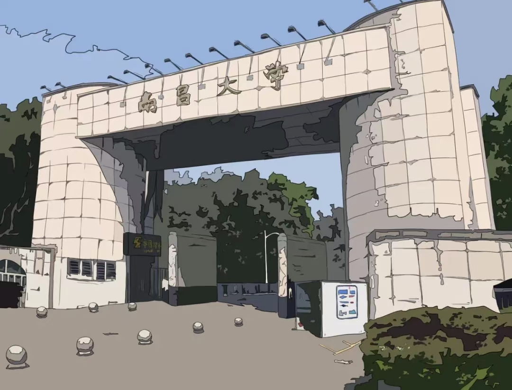
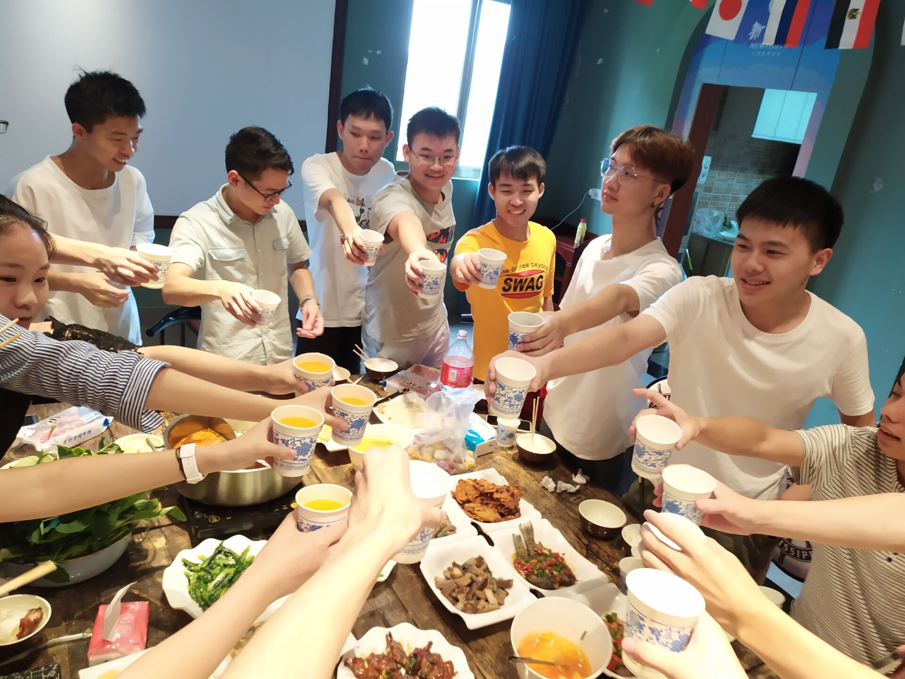
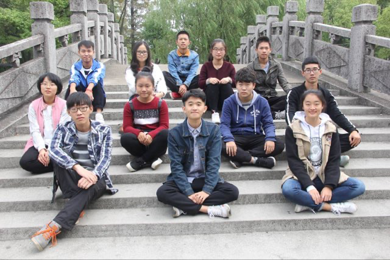
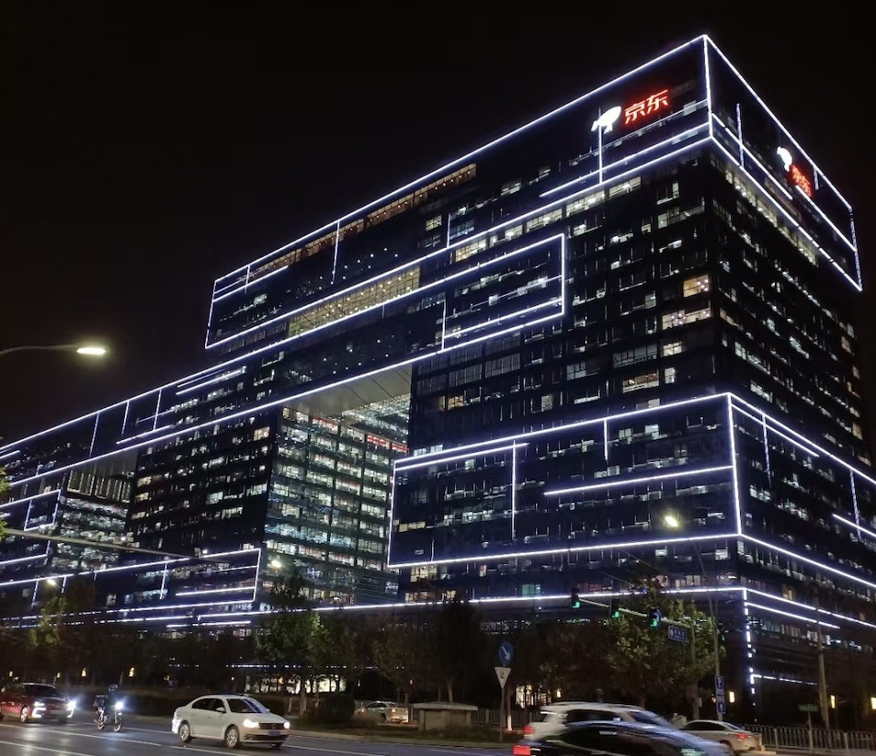
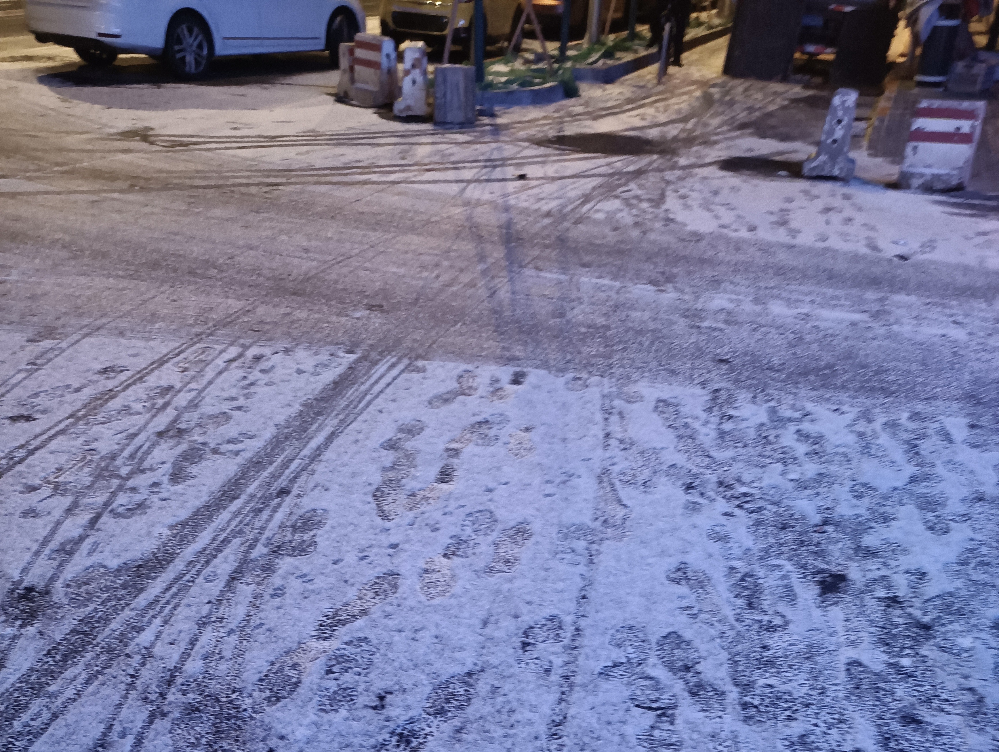
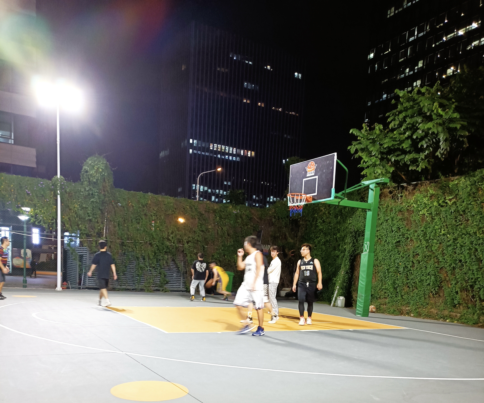
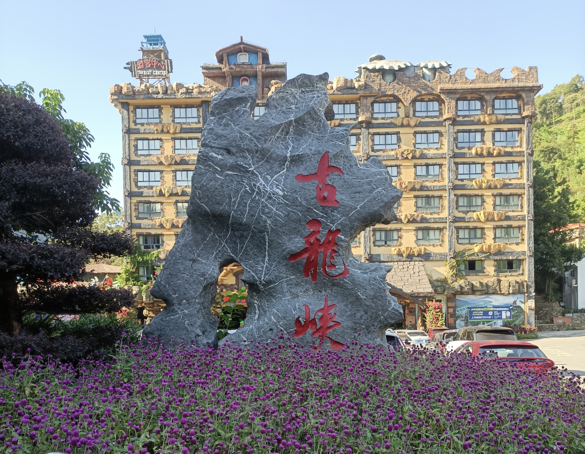

# 【告别与初见】2021年年度回忆录

告别与相逢，这是我对2021年的定义。

## 我毕业了！

2017年9月，我一个人来到了南昌，来到了软院，开始一段新的生活。

在软院生活的四年，我学到了赖以谋生的技能，从一个只会开关机的电脑小白成长为一个初窥门径的后端工程师。结识了几个不错的朋友，会一起扯皮，一起打球，一起闲聊数码产品。和一食堂汤粉一家的阿姨成为了朋友，每次我碗里的菜都是满满的。也认识了南昌，这座洪都新府，青山湖，滕王阁，八一广场，还有小软院外面的黄小七，南昌拌粉......这座阿卡林省的省会城市，纵使它还有很多不好的地方，但在我这里，它会是最特别的一座城市。

一些大学的旧照片，聊以纪念。

小软院

和友平他们的毕业照

软工171的一次聚餐

青志协秘书部的朋友们

毕业前的三清山之旅

可能稍有遗憾的是，9#716的同仁们，我们到毕业了也没能拍一张合照.......

大学里还有很多很多美好的回忆，也不一一细数了。

2021年6月，我在软院的生活画上了句号，整理衣物，收拾行李，离开了716，正式宣布了毕业。

毕业，这个字眼对我来说并不陌生。小学毕业，中学毕业，高中毕业，复读毕业，顺着中国的的教育体制按部就班的进行着。可能和大多数人不同的是，我复读了一年，也因此来到了软院。之前的每次毕业，我都会来到一个新的校区，认识新的同学，开始新的课程，然后按照升学的目标，开始了新一轮的考试练习。但是这次，我不会再去往一个新的校区了，我需要去一个更大的地方。

## 北京的实习之旅～

老实说，在我刚到软院那会，我还憧憬着之后能成功保研，走上人生巅峰，~~迎娶白富美~~的白日梦。但很显然，事情并没有如我所愿，大一下二点几的绩点彻底浇灭了我的幻想。保研是不可能保研了，考研又不愿意考，只能是找工作谋个生活这样子。

我在大学里并没有很好的掌握专业知识，受限于自己的学历，眼界和能力，找工作的初期并不顺利。

清晰记得，投出我第一封简历的时候是2020年的8月29日，我投递了58同城。等我收到58同城的正式offer时，已经到11月份了，那时的我，已经在京东那里实习。这期间，我投递了近一百家企业，投递的都是正式岗位。这中间有些受限于时间冲突而放弃面试，有些因为笔试题太难而无缘面试，有些则是在二面中铩羽而归。纵使其中也拿到十几个正式offer，但我始终不满意。

为了曲线救国，我投递了京东的实习岗位。

因为之前的面试经验和知识的积累，京东的实习面试异常的顺利。一面过后，面试官第二天就电话过来，问我是否有时间去现场实习，我自然是答应了下来。

2020年十一月初，我踏上了去北京的动车，去迎接我生平的第一次实习。

十一月的北京真的好冷啊！但是那天的阳光却异常的温暖。

这是我第一次去北京，出于对北京的憧憬，第一天的中午，我就和峥过一起去了天安门。

天安门前的随手拍

沿着天安门的青石砖路，从广场的正门途行，领略古朴朱红的城墙，鳞次节比的瓦砾，庄严辉煌的大殿，苍翠挺拔的古树，还有那古朴幽远历史厚重感。那一刻，我体会了余秋雨先生般的文化苦旅之行。紫禁城，不愧是中华文化的汇集之地。可惜我胸无点墨，无法描绘其神韵。

领域了紫禁城的风采，探路先行，我又赶在正式报道前，去了亦庄京东总部大厦。那天是2020年11月10日，双十一前夕。京东外面都是供应商玲琅满目的鲜花和商品，每束鲜花上都写着祝京东双十一大卖，门口广场上是京东的员工们在拍照留念，遇见的每个人都洋溢着开心的笑容，庆祝这一年中最重要的购物节。真好啊，我也马上就要在里面工作了。

京东总部大楼C座门口

报道，领取工卡，领取电脑，然后来到工位，开始了我的实习之旅。

因为作为实习生，我的工作任务都是很简单的，每天的工作内容就是做些内部网站的增删改查的小需求，很多时候，都不存在需求，都在摸鱼中度过，以至于每天的晨会是我最痛苦的时候，因为我真不知道我昨天又干了啥......虽然工作产出很少，但是我那段时间里，我见到了一个真实在线上运行的项目，了解了怎么做需求评审，怎么做技术方案，怎么按时把控开发进度，怎么上线一个小需求。这对于我来说，全部都是宝贵的经历。

实习的另外一个收获，是眼界。在京东的内部iwiki上，我学习了很多之前没有了解过的内容，技术。知道了这个世界上还有那么多我从来没有听说过的名词，概念。那一刻，我认识到了自己知识和眼界的单薄，我还有好多好多的内容需要去学习，去实践。实习期间，我几乎每个周末都会去公司，刷题，学习，了解新的知识。

另一方面，实习也让我认识了很多优秀善良的人。冯宝，玉明，杰哥，昱彤，凯哥，亮哥，还有大交通组的全体朋友们，大家都很优秀，也对我很友好照顾。在此还要特别感谢冯宝，在我加入火车票项目时，事无巨细的向我介绍火车票项目的整体架构，细节，甚至还帮我分担我为数不多的工作，我想，在我以后的职业生涯里，很难再遇到这么好的导师兼朋友了。

在生活上，每天干饭时，和干饭小分队的人一起闲聊；第一次吃生蒜；第一次领会到北方的各种美食；午饭后杰哥，昱彤，男哥一起去楼下散下步，领会北京零下五六度的冷风；每周三晚和玉明、泽哥、浩然一起去球馆打球；和大家的离别饭等等。点点滴滴的碎片，温暖了北京的冬天。

京东的人和事，都和想象中的一样的好。

2021年2月初，我提了离职，正式告别了京东。

夜晚的京东总部大厦

除去在京东的生活点滴，日常就是和峥过在出租屋里的生活了。虽然实习的报酬不多，其实也足够维系我在北京的生活了，但是为了节省开支，我还是选择临时住在峥过那里。峥过住的地方在北京的丰台区，处在西二环内。离天安门不算太远。当然，这也意味着，距离身处五环开外的亦庄会很远。京东的考勤是早上九点，工作日的时候，我每天都在六点前起床。简单洗漱，乘坐6点20的公交到马家堡站，然后转乘地铁去往亦庄。很多时候，我七点半左右就到总部大厦，那时候人很少，我可以不用排队，安静的在食堂吃个早饭。晚八点半左右，我会收拾东西回家，到家一般十点左右了。无数次，我与北京的朝阳与晚风相逢。忆苦思甜，我现在已经很久很久没有六点前起过床了，果然，每年都在变懒的路上。

有时候周末没去公司的时候，我和峥过会选择自己做饭，当然，我负责做饭，他负责洗碗，那段时间，感觉自己做饭的手艺都提升了一个等级。偶尔也会在北京的小巷里溜达，去过一条比较破旧的老胡同，在重重的高楼大厦中，那条老胡同显得遗世而独立。那里有很多小店，晚上有很多人去那里吃饭，像是漂流在北京的人的一处慰藉。

告别京东几天后，我告别了北京。

## 第一站，戴上红围脖。

在我离开北京的那一刻，我坚信我毕业后还是会回到那里，开始我的职业生涯的第一站。以至于我好些东西都放在峥过那里，并没有带回去。

直到我拿到了鹅厂的offer。

拿到鹅厂offer的时候是我今年最开心的一刻。得益于京东实习期间的学习和积累，我的春招比想象中顺利，但是在我真正拿到鹅厂offer的时候，我还是不敢相信。人生真是奇妙。

戴上红围脖，成为鹅厂人。2021年的七月，我来到了深圳。租房，入职，工作，开始新的生活。

提前清理的工位摆拍

和同组的伙伴们幸运的拿到了mini项目金奖

拿奖后的庆祝

封陪的朋友们

封陪晚会

深圳的第一场球

清远古龙峡漂流之旅

养了三盘绿植，现在已经枯萎了...

周末火锅日常

现在除了技术方案，已经很久不写文章，语言组织能力也大不如前了。就用上面的照片聊表心情吧。

在鹅厂的生活刚刚开始，期待更好的未来。

## 未来幻想，未知之路

一首小诗

> ​	**热爱生命**
>
> ​               -- 汪国真
>
> 我不去想是否能够成功
>
> 既然选择了远方
>
> 便只顾风雨兼程
>
> 我不去想能否赢得爱情
>
> 既然钟情于玫瑰
>
> 就勇敢地吐露真诚
>
> 我不去想身后会不会袭来寒风冷雨
>
> 既然目标是地平线
>
> 留给世界的只能是背影
>
> 我不去想未来是平坦还是泥泞
>
> 只要热爱生命
>
> 一切，都在意料之中

​																																		-- 黄龙，2022年1月1日晚 于深圳
